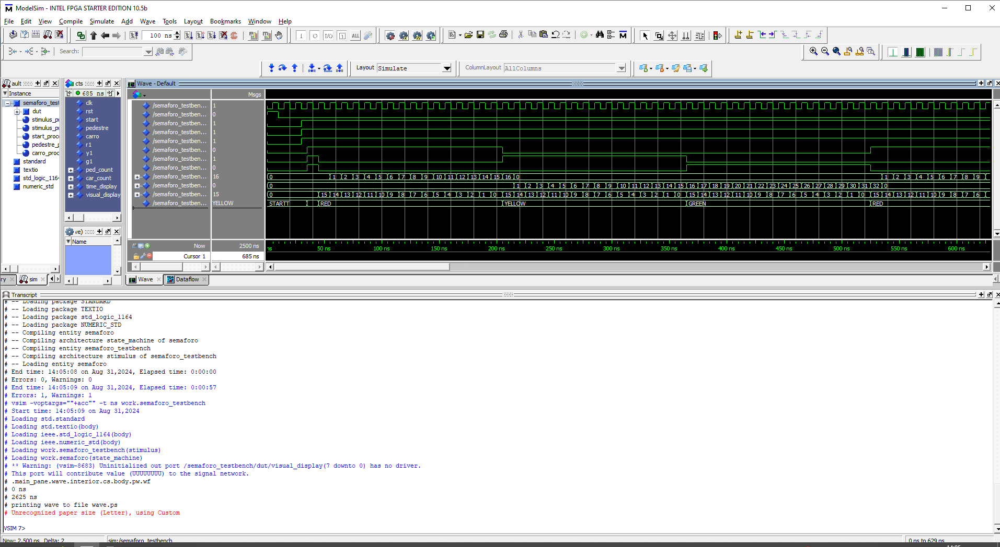
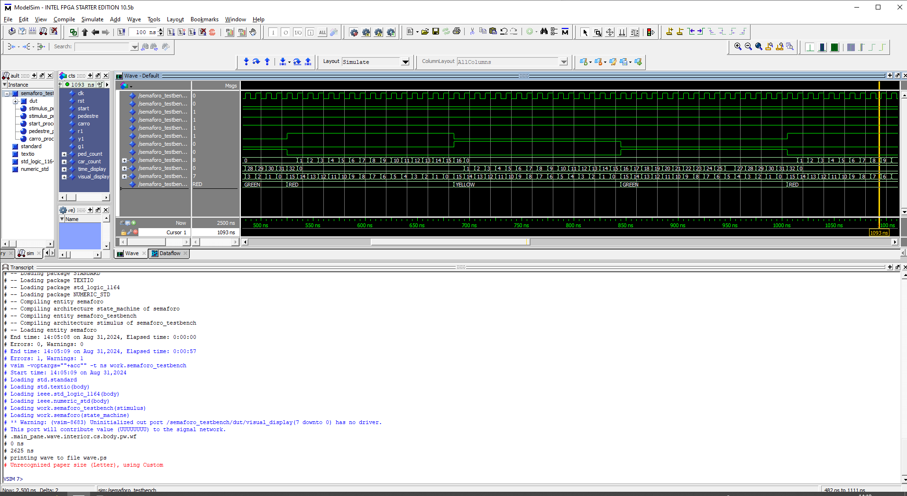
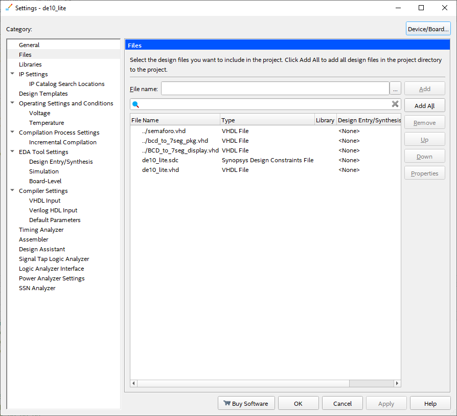

# SEMÁFORO
### Esta tarefa envolve a criação de um semáforo em VHDL baseada em máquina de estados com os seguintes funcionalidades:
- Controle dos estados luzes de um semáforo (Red, Yellow e Green);
- Contagem do número de pedestres (apenas no estado Red);
- Contagem do número de carros (apenas nos estados Yellow e Green);
- Exibição das luzes do semáforo, da contagem dos pedestres e carros, do tempo de cada semáforo.
-------------------------------------------------------------------
## 1 ESPECIFICAÇÕES
### 1.1 PORTAS DE ENTRADA
 - clk: Porta de entrada (interno) do tipo std_logic responsável pelo clock. 
 - rst: Porta de entrada (interno) do tipo std_logic responsável pelo rst. 
 - start: Porta de entrada (chave) do tipo std_logic responsável por iniciar o sistema. 
 - carro: Porta de entrada (chave) do tipo std_logic responsável pela contagem de carros. 
 - pedestre: Porta de entrada (chave) do tipo std_logic responsável pela contagem de pessoas. 

### 1.2 PORTAS DE SAÍDA
 - r1: Porta de saída (LED) do tipo std_logic responsável sinal vermelho do semáforo.
 - y1: Porta de saída (LED) do tipo std_logic responsável sinal amarelo do semáforo.
 - g1: Porta de saída (LED) do tipo std_logic responsável sinal verde do semáforo.
 - ped_count: Porta de saída (DISPLAY 7 SEGMENTOS) do tipo unsigned responsável pela visualização da contagem de pedestres.
 - car_count: Porta de saída (DISPLAY 7 SEGMENTOS) do tipo unsigned responsável pela visualização da contagem de carros.
 - time_display: Porta de saída (DISPLAY 7 SEGMENTOS) do tipo unsigned responsável pela visualização do tempo de cada estado.
 - visual_display: Porta de saída (DISPLAY 7 SEGMENTOS) do tipo unsigned responsável visualizar os segmentos.

### 1.3 ESTADOS

**STARTT**
 - Estado STARTT criado com valor 0, para que ele vá para o estado IDLE imediatamente, garantindo com que o estado RED assuma o valor do estado IDLE;

**IDLE**
 - Estado IDLE para garantir a contagem total do estado RED.
 - Sem o estado IDLE, o estado RED utiliza a mesma contagem de tempo IDLE No primeiro ciclo da máquina de estados.

**RED**
 - Deve ser contabilizado o tempo do estado e mostrado no display;
 - Deve ser contabilizado quantas pessoas atravessam e mostrado no displaY;
 - Não deve ser contabilizado quantas pessoas atravessam e mostrado no display;
 - O tempo do estado deve ser decrementado e chegar até 0;
 - Quando chegar em 0, o estado é alterado para o próximo estado.

**YELLOW**
 - Deve ser contabilizado o tempo do estado e mostrado no display;
 - Não deve  ser contabilizado quantas pessoas atravessam;
 - Deve  ser contabilizado o número de carros que passam e mostrado no display;
 - O tempo do estado deve ser decrementado e chegar até 0;
 - Quando chegar em 0, o estado é alterado para o próximo estado.

**GREEN**
 - Deve ser contabilizado o tempo do estado e mostrado no display;
 - Não deve  ser contabilizado quantas pessoas atravessam e mostrado no display;
 - Deve  ser contabilizado o número de carros que passam e mostrado no display;
 - O tempo do estado deve ser decrementado e chegar até 0;
 - Quando chegar em 0, o estado é alterado para o próximo estado.

## 2 PINAGEM

**Leds**
 - LEDR (0) --> r1
 - LEDR (1) --> y1
 - LEDR (2) --> g1

**Chaves**
 - SW(0) --> start
 - SW(1) --> rst
 - SW(8) --> carro
 - SW(9) --> pedestre

**Displays**

 - HEX0 --> ped_count.
 - HEX1 --> car_count.
 - HEX2 --> time_display.
 - HEX4 --> segmentos de time_display (15 a 8).
 - HEX5 --> segmentos de time_display (7 a 0).

## 3 FUNCIONAMENTO

 - 1) Simular no modelsim;
 - 2) Gravar na placa;
 - 3) Colocar rst em nivel ALTO;
 - 4) Colocar rst em nivel BAIXO;
 - 5) Colocar start em nivel ALTO;

   **No primeiro ciclo da máquina de estados**
 - Estado STARTT iniciado.  LEDR (0), LEDR (1) e LED (2) acesos; tempo 0 segundos.
 - Estado IDLE iniciado.  Apenas LEDR (2) aceso; tempo estabelecido pelo estado RED; tempo 15 segundos.
 - ESTADO YELLOW inicado. Apenas LEDR (1) aceso; tempo estabelecido pelo estado YELLOW; tempo 15 segundos.
 - ESTADO GREEN inicado. Apenas LEDR (0) aceso; tempo estabelecido pelo estado GREEN; tempo 15 segundos.

   **No segundo ciclo da máquina de estados**
 - Estado RED iniciado.  Apenas LEDR (2) aceso; tempo estabelecido pelo estado RED; tempo 15 segundos.
 - Estado YELLOW iniciado.  Apenas LEDR (1) aceso; tempo estabelecido pelo estado YELLOW; tempo 15 segundos.
 - Estado GREEN iniciado.  Apenas LEDR (0) aceso; tempo estabelecido pelo estado GREEN; tempo 15 segundos.

## 4 SIMULAÇÃO
 - 1) Abrir o software Modelsim
 - 2) cd C:/Users/elvis/OneDrive/Documentos/projeto_final/riscv-multicycle-master/riscv-multicycle-master/peripherals/semaforo2
 - 3) do tb.do
 - 4) Imagens da simulação
   
No primeiro ciclo da máquina de estados.

A partir do segundo ciclo da máquina de estados.

  
## 5 GRAVAÇÃO
 - 1) Abrir o software Quartus Prime
 - 2) Assignments >> Settings... >> ...

  Adicionar: 
  - semaforo.vhd
  - BCD_to_7seg_display.vhd
  - bcd_to_7seg_pkg

              

